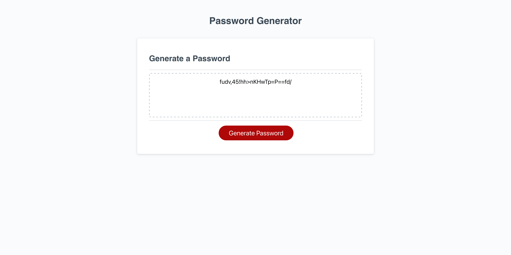

# Canaan Owens: Nifty Password Generator

# 03 JavaScript: Password Generator

## Task

Create an application that enables employees to generate random passwords based on criteria that they’ve selected. This app will run in the browser and will feature dynamically updated HTML and CSS powered by JavaScript code that I write. It will have a clean and polished, responsive user interface that adapts to multiple screen sizes.  
 This application will contain, Uppercase letters, lowercase letters, numbers and special characters.

## Screenshot

